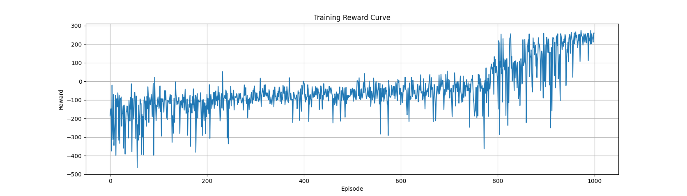

# LunarLander DQN Agent

This project implements a Deep Q-Network (DQN) to train an agent in the `LunarLander-v2` environment from Gymnasium. The goal is to achieve a reward threshold greater than 200 using reward shaping and exploration strategies. Training is optimized to complete in under 2 hours on standard CPU/GPU setups.

## Setup Instructions

### 1. Create and Activate Conda Environment
```bash
conda create -n lunarlander-dqn python=3.10
conda activate lunarlander-dqn
```

### 2. Install Dependecies
```bash
pip install gymnasium
pip install gymnasium[box2d]
```

If you encounter installation issues, run the following to install swig:
```bash
sudo apt install swig
```

Then, install the necessary machine learning libraries:
```bash
pip install torch torchaudio torchvision  # Automatically installs CUDA dependencies

# If you're using CPU only, you can install the CPU version of PyTorch by using pip install torch torchvision torchaudio --index-url https://download.pytorch.org/whl/cpu

pip install numpy matplotlib
```

### 3. Training the Agent
To train the agent using DQN, run the following command:
```bash
python train.py
```

The training process will:
- Train the DQN agent on the LunarLander-v2 environment.
- Save rewards per episode to the file rewards.npy.
- Plot the training performance (reward per episode) once training is complete.
Training performance is measured as the reward per episode. The goal is to achieve a reward above 200, which indicates successful landing.

## Reward Shaping & Exploration Strategies
### 1. Reward Shaping
Reward shaping involves modifying the environment’s reward signal to encourage the agent to learn specific behaviors. In the LunarLander-v3 environment, the following adjustments were made to the reward function:
- Proximity to Landing Pad: The reward increases as the agent gets closer to the landing pad.
- Speed: A penalty is added for fast horizontal movement, while slower movement is encouraged. However, when the Lander reaches closer to the ground, it was noticed that the lander was landing just outside the target zone. Hence, some horizontal movement is encouranged close to the ground, to allow it to move with needing excessive tilt.
- Angular Tilt: A penalty is added for excessive tilt, discouraging the agent from landing with an unstable angle.

### 2. Exploration Strategy
The agent employs an epsilon-greedy policy, where:
- The agent explores the environment with a random action with probability epsilon.
- The agent exploits its learned policy with probability 1 - epsilon.
- The epsilon value decays over time to a lower value to balance exploration and exploitation as the agent learns.

## Running the Trained Agent
Once the agent is trained, you can run the agent on the environment and visualize its performance using run_agent.py.
Run the agent with:

```bash
python run_agent.py
```

This will load the trained model and display the agent interacting with the environment.

## File Descriptions
### 1. train.py
This file handles the training of the DQN agent. It defines the training loop, including:
- Environment setup.
- Model initialization.
- Training loop with experience replay and updates.
- Saving rewards per episode for plotting.

### 2. model.py
Contains the definition of the Deep Q-Network (DQN) architecture. It is built using PyTorch and consists of a neural network with fully connected layers. The input is the environment’s state (e.g., position, velocity, and angle), and the output is the Q-values for each possible action.

### 3. utils.py
- Replay Buffer: Stores the agent’s experiences (state, action, reward, next state, done) for later use in training.
- Wrappers: Helper functions for preprocessing or modifying the environment (e.g., normalizing observations).
- Experience Sampling: Samples a batch of experiences for training.

### 4. run_agent.py
- Loads the trained model and evaluates it in the LunarLander-v2 environment.
- Displays the agent’s performance by rendering the environment, if required, as the agent interacts with it.

## Training Performance Plot
This plot was plotted from the values of rewards.npy.


